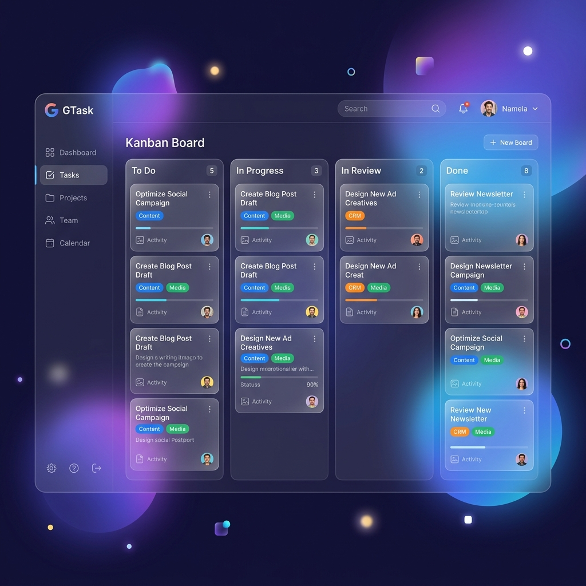

# Hướng Dẫn Sử Dụng GTask — Hệ Thống Giao Việc Phòng Marketing

Tài liệu này hướng dẫn chi tiết về vai trò, quyền hạn và quy trình làm việc trên hệ thống GTask dành cho các thành viên phòng Marketing (bao gồm 3 nhóm: **Content**, **Media**, và **CRM**).



---

## 1. Phân Quyền Chi Tiết Theo Vai Trò (Roles)

Hệ thống GTask chia làm 4 vai trò chính với các mức độ kiểm soát khác nhau:


### 1.1. Admin (Quản trị viên)
Đây là tài khoản quản trị hệ thống cao nhất.
* **Quản trị thành viên:** 
  * Thay đổi chức danh công việc của bất kỳ nhân viên nào.
  * Nâng/hạ quyền (phân vai trò: Admin, Manager, Member) cho tất cả tài khoản.
  * Bật/tắt kích hoạt tài khoản (`Active/Inactive`).
* **Quản trị nhóm:**
  * Thêm/bớt thành viên vào 3 nhóm mặc định: **Content**, **Media**, **CRM**.
  * Bổ nhiệm trưởng nhóm (**Leader ⭐**) hoặc bãi nhiệm trưởng nhóm của từng nhóm.
* **Quản lý công việc:** Toàn quyền Tạo, Sửa, Duyệt và Xóa tất cả các công việc (tasks) trên toàn phòng.

### 1.2. Trưởng phòng (Manager)
Vai trò dành cho người quản lý chung toàn phòng Marketing.
* **Giao việc linh hoạt:** Tạo và giao việc cho bất kỳ nhân viên nào thuộc bất kỳ nhóm nào trong phòng.
* **Giám sát & Quản lý:** 
  * Theo dõi tiến độ công việc trên **Bảng Kanban** toàn phòng hoặc lọc riêng theo từng nhóm.
  * Hủy công việc bất kỳ nếu thấy không còn cần thiết.
* **Duyệt hoàn thành:**
  * Xem danh sách các công việc đang ở trạng thái **Chờ tôi duyệt** tại trang chủ.
  * Phê duyệt hoàn thành công việc hoặc **Trả lại** việc kèm theo lý do cụ thể (hệ thống sẽ tự động ghi nhận lý do vào mục thảo luận của task).

### 1.3. Trưởng nhóm (Leader ⭐)
Quyền trưởng nhóm gắn liền với từng nhóm cụ thể (được Admin thiết lập trong trang Quản trị).
* **Giao việc trong nhóm:** Tạo và giao việc cho các thành viên thuộc nhóm do mình quản lý.
* **Duyệt việc trong nhóm:** Phê duyệt hoàn thành hoặc **Trả lại** công việc cho các thành viên trong nhóm mình phụ trách.
* **Làm việc độc lập:** Leader vẫn có thể tự giao việc cho bản thân hoặc nhận việc được giao từ Trưởng phòng/Admin (lúc này thực hiện như một nhân viên thường).

### 1.4. Nhân viên (Member)
Vai trò dành cho thành viên thực thi trong các nhóm.
* **Tự quản lý công việc:** 
  * Xem danh sách công việc cá nhân được phân chia theo thời gian: *Trễ hạn, Hôm nay, Tuần này, Sau đó*.
  * Tự tạo công việc cá nhân cho bản thân để quản lý.
* **Cập nhật tiến độ:** 
  * Chuyển trạng thái công việc sang **Đang làm** khi bắt đầu xử lý.
  * Chuyển trạng thái sang **Chờ duyệt** (nộp sản phẩm) khi hoàn thành.
* **Trao đổi thảo luận:** Viết bình luận, phản hồi và thảo luận trực tiếp bên trong thẻ công việc để trao đổi với người giao việc.
* **Nhận thông báo:** Nhận thông báo (chuông 🔔) tức thì khi được giao việc mới, có bình luận mới, hoặc khi việc được duyệt/trả lại.

---

## 2. Quy Trình Vận Hành Công Việc (Workflow)

Vòng đời của một công việc trên GTask diễn ra theo sơ đồ sau:

```
[Mới] ──(Nhân viên nhận việc)──> [Đang làm] ──(Nộp duyệt)──> [Chờ duyệt]
                                     ^                           │
                                     │                           ├──(Duyệt)──> [Hoàn thành]
                                     └──────(Trả lại + lý do)────┘
                                     
*Lưu ý: Công việc ở bất kỳ trạng thái nào cũng có thể bị [Hủy] bởi Manager hoặc người giao việc.*
```

### Các bước thực hiện chi tiết:
1. **Bước 1 (Giao việc):** Manager/Leader/Cá nhân tạo công việc $\rightarrow$ Chọn nhóm, người thực hiện, mức độ ưu tiên, mô tả (brief) và hạn chót (deadline).
2. **Bước 2 (Nhận việc):** Nhân viên nhận được thông báo $\rightarrow$ Vào chi tiết công việc bấm **Bắt đầu làm** để chuyển trạng thái sang `Đang làm` (hoặc kéo thẻ trên bảng Kanban).
3. **Bước 3 (Nộp sản phẩm):** Nhân viên làm xong $\rightarrow$ Bình luận link sản phẩm/kết quả và bấm **Nộp duyệt** để chuyển trạng thái sang `Chờ duyệt`.
4. **Bước 4 (Phê duyệt hoặc Trả lại):**
   * **Duyệt:** Người giao việc kiểm tra kết quả, bấm **Duyệt hoàn thành** $\rightarrow$ Trạng thái chuyển sang `Hoàn thành` và ghi nhận thời gian hoàn tất.
   * **Trả lại:** Nếu chưa đạt yêu cầu, bấm **Trả lại** kèm nhập lý do $\rightarrow$ Công việc quay về trạng thái `Đang làm` để nhân viên sửa đổi.
